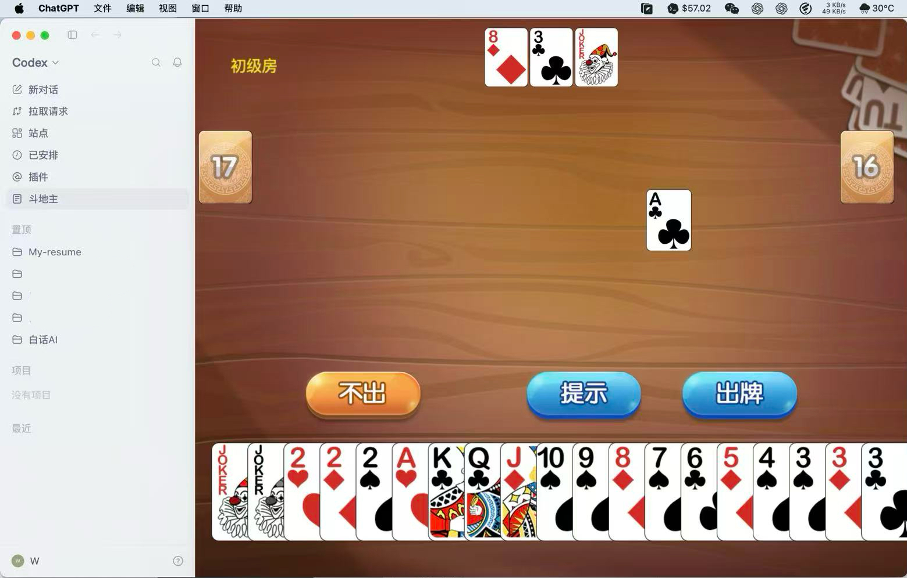
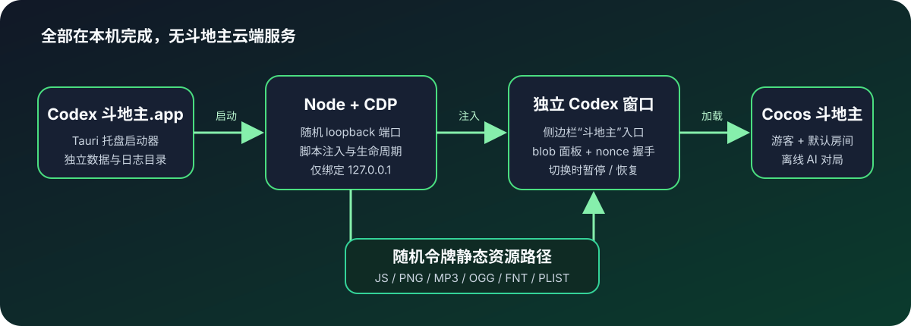

# Codex 斗地主

在独立的 Codex 窗口中游玩本地单机斗地主。应用只向侧边栏增加一个“斗地主”入口，不包含任务面板、任务数据库、CLI、Skill 或云端服务。

> [!IMPORTANT]
> 本项目仅供个人本机使用。内置游戏来自一个未声明许可证的上游仓库，请勿公开发布、转售或团队分发。



## 功能

- 双击应用后启动一个独立的 Codex 窗口，并自动打开“斗地主”面板。
- 自动创建游客与初级房，跳过登录、大厅和选房，首局直接发牌。
- 保留原游戏的规则、AI、美术和音效，胜负结束后可点击原“准备”按钮继续下一局。
- 切换到 Codex 原生页面时暂停游戏调度与声音，返回后继续当前牌局。
- 游戏资源全部从 `127.0.0.1` 本地服务加载，运行期间不依赖斗地主后端。
- DMG 同时支持 Apple Silicon 和 Intel Mac。

## 快速安装

### 系统要求

- macOS 14 或更高版本。
- 已安装官方 [ChatGPT macOS App](https://openai.com/chatgpt/desktop/) 或 Codex App。推荐放在 `/Applications`。

### 从 DMG 安装

1. 在仓库的 **Releases** 页面下载 `Codex-Doudizhu-1.0.0-universal.dmg`。
2. 打开 DMG，将 `Codex 斗地主.app` 拖入“应用程序”文件夹。
3. 双击 `Codex 斗地主.app`。应用会启动独立的 Codex 窗口，并自动进入牌桌。

此构建使用本机 ad-hoc 签名，没有 Developer ID 公证。若 macOS 阻止首次启动，请在 Finder 中右键应用并选择“打开”。仍被隔离时，仅在确认文件来自你自己的私有仓库后运行：

```bash
xattr -dr com.apple.quarantine "/Applications/Codex 斗地主.app"
```

## 使用方法

- 首局会自动准备并发牌，无需登录或选择房间。
- 一局结束后，点击游戏原有的“准备”按钮开始下一局。
- 点击 Codex 的“新对话”“插件”等原生入口会隐藏并暂停游戏；再次点击侧边栏“斗地主”即可继续。
- 菜单栏托盘图标提供“打开斗地主”“重新打开 Codex”和“退出”。

## 从源码构建

先安装 Xcode Command Line Tools、Node.js 22.5 或更高版本，以及 [rustup](https://rustup.rs/)。仓库固定使用 Rust 1.88.0：

```bash
xcode-select --install
rustup toolchain install 1.88.0
rustup target add --toolchain 1.88.0 aarch64-apple-darwin x86_64-apple-darwin
npm ci
npm run check
```

开发模式直接启动：

```bash
npm run codex
```

构建 universal App 和 DMG：

```bash
npm run app:build
```

产物位于：

```text
src-tauri/target/universal-apple-darwin/release/bundle/macos/Codex 斗地主.app
src-tauri/target/universal-apple-darwin/release/bundle/dmg/
```

构建脚本会下载并校验官方 Node.js arm64/x86_64 二进制，再合并为 universal sidecar。无需安装 Cocos Creator。

## 工作方式



- Tauri 菜单栏应用负责启动和停止 Node launcher。
- launcher 使用独立 profile 启动官方 Codex，并通过 CDP 注入单一侧边栏入口。
- 游戏 iframe 使用 Codex CSP 允许的 `blob:app://-` 文档引导，再从带随机实例令牌的 loopback URL 加载本地 Cocos 资源。
- 父页面与游戏通过一次性 nonce 完成 `bridge-ready` 和 `ready` 握手，并传递暂停、恢复状态。
- 官方 Codex App 包不会被修改。

## 数据与日志

独立 profile 与日志分别位于：

```text
~/Library/Application Support/Codex 斗地主/
~/Library/Logs/Codex 斗地主/launcher.log
```

删除应用不会自动删除这些目录。

## 故障排查

**提示找不到 ChatGPT/Codex**

确认官方 App 位于 `/Applications/ChatGPT.app`、`~/Applications/ChatGPT.app`、`/Applications/Codex.app` 或 `~/Applications/Codex.app`。

**首次启动被 macOS 阻止**

先在 Finder 中右键应用并选择“打开”。仅对可信的私有 Release 使用上面的 `xattr` 命令。

**窗口未打开或牌桌未出现**

点击菜单栏图标，选择“重新打开 Codex”，然后检查 `~/Library/Logs/Codex 斗地主/launcher.log`。

**进入游戏后暂时没有声音**

Chromium 可能在首次交互前阻止自动播放。点击一次牌桌后，后续音频即可正常播放。

## 安全与隐私

- 静态服务器只监听 `127.0.0.1`，使用随机端口和随机路径令牌，不监听局域网。
- 跨源读取只允许 Codex 的 `app://-` 来源。
- 游戏使用独立 Codex profile，不读取或覆盖官方 App 的默认 profile。
- 斗地主资源随应用本地提供，游戏运行期间不会连接上游斗地主服务器。

## 上游项目与许可说明

- Codex 启动、CDP 与注入机制基于 [dashi-taskboard v1.0.8](https://github.com/chuspeeism/dashi-taskboard/releases/tag/v1.0.8)，固定提交 `57f1f8c9b24598bc3d3ef1d8a40554fc3c5d1f47`。相关 Apache-2.0 声明见 [UPSTREAM-DASHI-LICENSE](UPSTREAM-DASHI-LICENSE)。
- 游戏构建来自 [VYuLinLin/doudizhu-stand-alone](https://github.com/VYuLinLin/doudizhu-stand-alone/tree/98ef391bb0f04828d6fcf9af244fc2de4d6c2253)，固定提交 `98ef391bb0f04828d6fcf9af244fc2de4d6c2253`。
- 斗地主上游仓库未声明许可证，并引用了第三方界面与算法项目。因此本仓库不授予游戏资源的再分发许可，默认应保持私有。

## 版本

当前版本为 `1.0.0`，关闭自动更新，仅提供本机 ad-hoc 签名构建。
